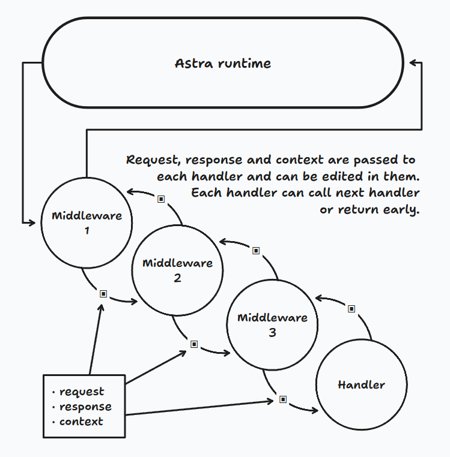

This example shows how to implement middleware.

The insperation was taken from [Clojure](https://clojure.org/) community. To dig deeper, you can read about *interseptors* in [Pedestal documentation](https://pedestal.io/pedestal/0.7/guides/what-is-an-interceptor.html#_queue_and_stack).


In short, each route has a root handler that is wrapped in another function, which is wrapped in another function, which is wrapped... you got it. And also we pass a context table as a third argument for inter-middleware communication.

Here is a *best effort* visualization:




Each middleware takes a `next_handler` function which can be a root handler or an another middleware.
Each middleware has `Entry` and `Leave` part. If everything is ok in Entry logic, middleware calls `next_handler`, otherwise, it can return early.

```lua
local function my_middleware(next_handler)
    return function(request, response, ctx)
        -- Pre-handler logic
        if "something wrong" then
            return "Waaait a minute."
        end
        local result = next_handler(request, response, ctx)
        -- Post-handler logic
        if "you came up with a use case" then
            local things = "Do some on-Leave logic"
        end
        return result
    end
end
```
