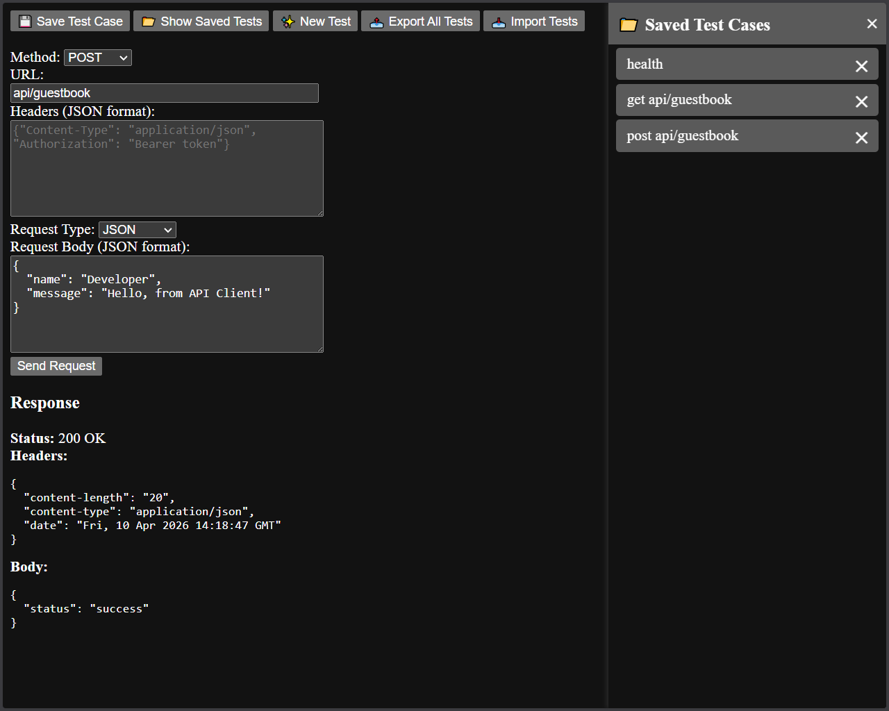
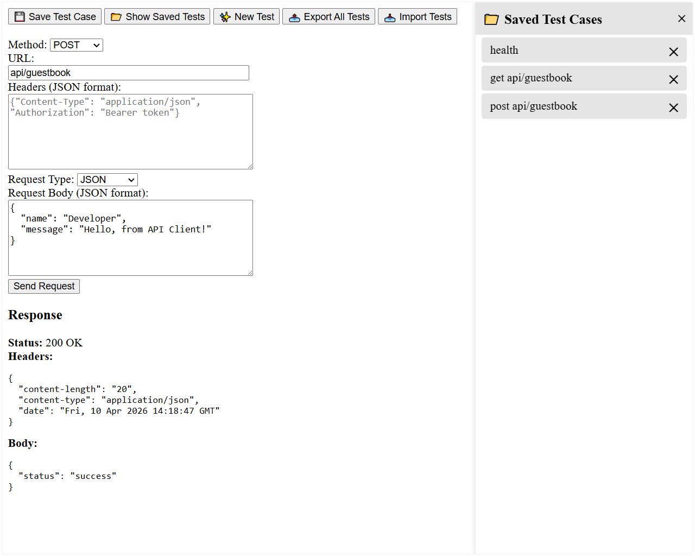

A simple API testing utility, forked from [DigiSoch/API_testing_utility](https://github.com/DigiSoch/API_testing_utility).

I’ve made some minor improvements, including UI tweaks[^1] and bug fixes.

You can save, export, and import test cases for easy reuse.

[^1]: Adjust the CSS styling to your taste :)